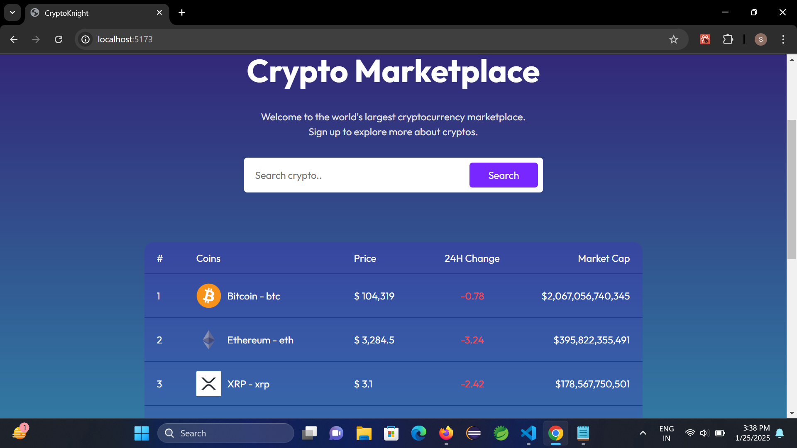
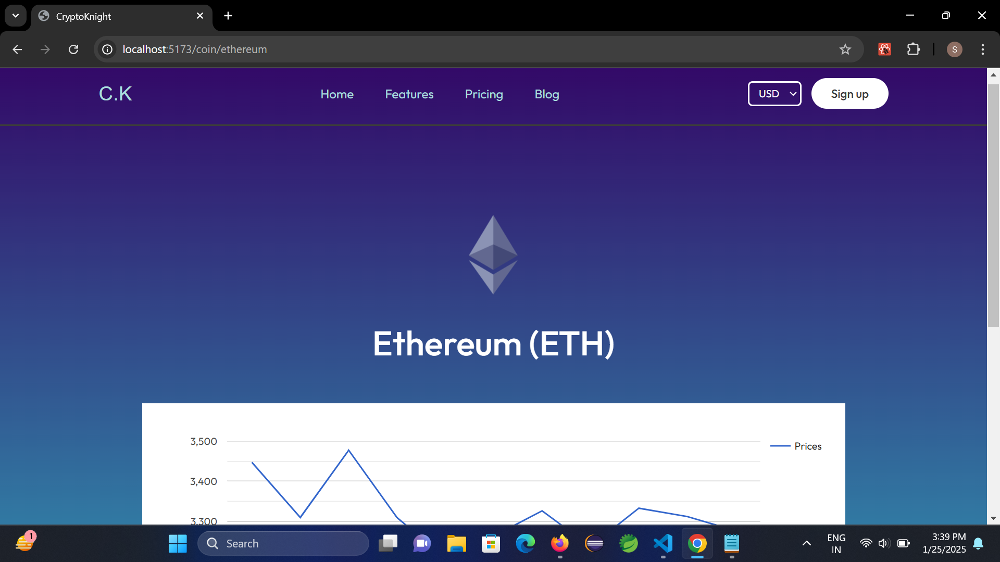
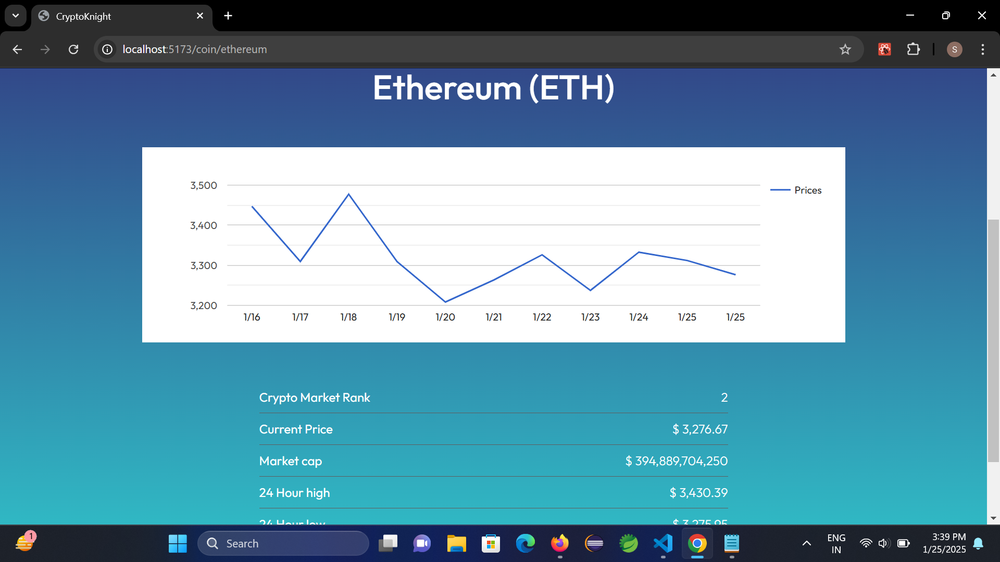

# 🛡️ Crypto Knight

**Crypto Knight** is a modern cryptocurrency information site developed using **React**. It provides users with real-time cryptocurrency data, interactive charts, and market trends, all wrapped in a sleek and responsive design.

---

## 🌟 Features

- **Live Crypto Data**: Stay updated with the latest stats on cryptocurrencies.
- **Modern UI/UX**: A clean and visually appealing interface for a seamless user experience.
- **Market Trends & Analytics**: Dive into interactive charts for better insights.
- **Search & Filter**: Quickly search and filter information on cryptocurrencies.
- **Responsive Design**: Fully optimized for mobile, tablet, and desktop.

---

## 🛠️ Tech Stack

- **Frontend**: React, Modern CSS
- **Backend**: Not applicable (frontend-only)
- **API**: Crypto data fetched via external REST APIs
- **State Management**: React Context API for global state handling

---

## 🖼️ Screenshots

### 1. Home Page

### 2. Cryoto Knight pages

---

